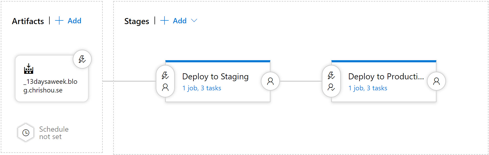

When I decided to get back into blogging after having ditched my previous effort a few years back, I had two initial thoughts.  First, I wanted to take a look at options were available for blogging platforms.  Second, I wanted to start my post off with something more interesting than the obligatory "here's how I built my blog" post.  Well, as of this post, I'm 1 for 2 in those goals as I'm about to run you through how I'm deploying and hosting my shiny new blog using <a href="https://jekyllrb.com/" target="_blank">Jekyll</a>, <a href="https://azure.microsoft.com/en-us/services/devops/" target="_blank">Azure DevOps</a> and <a href="https://docs.microsoft.com/en-us/azure/storage/blobs/storage-blob-static-website" target="_blank">Azure Static Website Hosting</a>.

# Hosting Options
Before I retired my previous blog, I was using <a href="https://wordpress.com/" target="_blank">WordPress</a> on a VPS host.  Despite having absolutely zero PHP experience, this worked out pretty well for me.  It was intuitive to setup and easy to configure to meet my fairly minimal needs.  One of my desires with my new blog was to host it on <a href="https://azure.microsoft.com/" target="_blank">Microsoft Azure</a>, since my day job involves helping Microsoft's customers build great things on Azure.  It turns out there are two options for running WordPress in Azure.  First, there's an option in the <a href="https://azure.microsoft.com/en-us/blog/how-to-host-a-scalable-and-optimized-wordpress-for-azure-in-minutes/" target="_blank">Azure Marketplace</a> that provisions WordPress on Azure App Service, Azure Storage and hosted MySQL.  This is a super easy way to get WordPress up and running on top of highly scalable PaaS services.  The other option would be to provision one or more virtual machines and install WordPress and it's dependencies yourself.  There's obviously trade offs to both of these approaches, but for me, since I'm paying for hosting myself, and, let's face it, I'm pretty cheap, both of these options are out of my budget.

Another option I considered is <a href="https://ghost.org/" target="_blank">Ghost</a>.  Ghost is really appealing to me because it's built on NodeJS, something I have at least some experience with.  Ghost could easily be hosted on a VM in Azure, and while there isn't an official Ghost offering in the Azure Marketplace, a quick search will show that there are at least a few options for running on Azure App Service.  Again, like with WordPress, both of these hosting options are have their place, but for me, they're outside of my budget.

## Static Site Generators
One drawback of platforms such as WordPress and Ghost is the dependency they have on their database and server-side frameworks.  To ensure we stay ahead of security vulnerabilities, we need to stay on top of new releases and security patches for things like PHP, our database and any dependent libraries.  With this in mind, and considering that a CMS like WordPress or Ghost really brings along a lot more capabilities than I really need, I was interested in exploring static site generators as an option for blogging.

For the uninitiated, a static site generator is a tool that takes static content and a set of templates as input and outputs plain old HTML, images, JavaScript and CSS.  This means that when it comes to serving your site, you don't need any server-side frameworks or databases.  You simply need a web server to serve that static content.  There are a number of different static site generators available, but I investigated two in particular, based on the recommendation of colleagues.  

### GatsbyJS
<a href="https://www.gatsbyjs.org" target="_blank">GatsbyJS</a> is a static site generator based on React.  At this point, I should disclose that I am not now, nor do I aspire to become a front-end developer.  Unfortunately, it was on this point that GatsbyJS lost me.  Browsing through their documentation, it pretty quickly got into writing GraphQL queries and editing markup.  I'm sure GatsbyJS is a fine framework and that there are templates available that minimize the need to learn things like React and GraphQL, but based on what I saw in their docs, I decided to move on to another option.

### Jekyll
The next, and as it turns out, final option I looked at is <a href="https://jekyllrb.com/" target="_blank">Jekyll</a>.  Jekyll is based on Ruby and takes markdown as input.  Within about 10 minutes, I was able to spin up a Jekyll based site locally.  That includes the time to find a custom theme and downloading/installing Ruby on my Windows laptop.  Based on this experience, Jekyll absolutely met my unspoken laziness requirement, that is, not having to learn a whole new tech stack to spin up a blog.

# Hosting a Jekyll Blog
Chances are, if you're familiar with Jekyll, it's in the context of hosting content on <a href="https://pages.github.com/" target="_blank">GitHub Pages</a>.  If you're not familiar with GitHub Pages, it's an awesome, and easy way to host static content out of a GitHub repository.  What's even better, if your repo has a Jekyll site in it, GitHub will trigger a Jekyll build and deploy your static content based on commits to your repo.  As if all of that isn't awesome enough, GitHub Pages also supports using your own custom domain and HTTPS.  HTTPS leverages <a href="https://letsencrypt.org/" target="_blank">Let's Encrypt</a> and GitHub Pages takes care of automating the request and renewal of your cert.  Oh, and did I mention that all of this, hosting, building and HTTPS is free?  Pretty awesome, right?  Unfortunately, there's one limitation to hosting Jekyll on GitHub pages that caused me to look elsewhere for hosting.  It turns out that for building Jekyll sites, GitHub Pages has a <a href="https://pages.github.com/versions/" target="_blank">pre-defined list of Jekyll plugins</a> that are supported.  Unfortunately, it turns out that the theme I'm using has at least one plugin that isn't currently supported by GitHub.  Of course I could have ditched the theme and found a different one, but I'll be honest, I kind of liked the way it looked, and I was curious about exploring another specific hosting option, <a href="https://docs.microsoft.com/en-us/azure/storage/blobs/storage-blob-static-website" target="_blank">Static Website Hosting in Azure Storage.</a>

# Azure Storage Static Website Hosting
If you haven't looked at Static Website Hosting in Azure Storage, it's a super easy way to serve static content out of a Blob Storage container.  Once you enable it, you can upload HTML, images, CSS and JavaScript to a special container in your storage account.  You'll get special URL for your container that can be used to access your content via HTTP and can then put a CDN in front of it or something similar.  

Enabling this feature in your storage account couldn't be simpler.  To enable through the Azure portal, just navigate to your storage account and find the Static website option.  You'll see a toggle switch that will allow you to enable the feature.  Once enabled, you'll have the option to set a default document and error document name as you can see below.


Once you have your static website setup, you'll probably want to add a custom domain and HTTPS to your site.  Adding a custom domain is accomplished by setting up a CNAME record with your DNS provider that points to the HTTP endpoint for your static site.  SSL is a bit trickier.  Your storage account and the HTTP endpoint have a certificate associated with them out of the box, however it's a wildcard certificate provided by Azure for *.web.core.windows.net.  This means that if you use a custom domain, you need a way to also have a certificate that matches your domain name.  The Static Website feature itself doesn't actually support this, however placing Azure CDN in front of your storage account's HTTPS endpoint will allow you to easily add a certificate that matches your custom domain name.  In fact, Azure CDN gives you an option to bring your own certificate or to let Azure provision and manage the certificate lifecycle for you.

## Validating Deployments
One feature that you don't get with Static Website Hosting is <a href="https://docs.microsoft.com/en-us/azure/app-service/deploy-staging-slots" target="_blank">Deployment slots</a>.  If you haven't used Deployment Slots, they're an extremely useful feature that allow you to deploy multiple versions of your web app side-by-side in a single App Service instance.  They provide a great way of testing out a new deployment before you push it to your end users.  I personally find this capability indispensable, so in the approach below, you'll see how I built a similar capability using two separate storage accounts, one for staging, one for production.

# Deploying to Azure Blob Storage
So, now that we have our storage account, DNS and SSL configured, we need to think about how we're going to publish content.  Since static site hosting is based on a blob container, we could certainly do a manual upload of files via the Azure portal, but, since I'm a developer at heart, I really want a much more lazy approach.  Keep in mind, when publishing a Jekyll blog, there are really two steps.  The first is building.  This is where Jekyll processes your markdown + templates and outputs static HTML.  The second part is deploying the output from the build process, the contents of your ```_site``` directory.  Thinking about this two step process, it sounds a lot like something that could be done using Azure DevOps build and release pipelines.

## Building a Jekyll site in Azure DevOps
From what I saw getting Jekyll to build and serve on my laptop, I figured building the site in Azure DevOps should be similarly easy...if I could figure out how to get Ruby installed on a build agent.  I assumed that I'd end up having to run a bunch of script tasks to get this happen, but, as it turns out, Azure DevOps already takes care of all of this, via the <a href="https://docs.microsoft.com/en-us/azure/devops/pipelines/tasks/tool/use-ruby-version?view=azure-devops" target="_blank">UseRubyVersion task</a>.  Using this task in your pipeline will ensure that your agent has the version of Ruby installed that you specify, and that Ruby is in your path.  Beyind getting Ruby installed, there are three other things that we need the pipeline to do:

1. Run ```bundle install``` for both my staging and production configurations
2. Create a zip file with the production _site directory and another zip file with the staging _site directory
3. Publish the production and staging zip files as build artifacts.

Each of the above steps turned out to be really easy to acomplish using tasks available in build pipelines.  The only piece that required a little additional thought was how to handle a staging and production configuration.  In the end, what I opted to do was to stick my produciton configuration for the site in _config.yml and any overrides that need to be different in staging in a separate file, _config_staging.yml.  Using this approach, when I build the staging site, I can pass in both config files as arguments.  Specifying _config_staging.yml as the second argument will cause any parameters in that file to override paramters of the same name in _config.yml.

Below you can see my final build pipeline:

```YAML
trigger:
- master

pool:
  vmImage: 'Ubuntu-16.04'

steps:
# Set Ruby version to ensure we have Ruby and required tools
- task: UseRubyVersion@0
  inputs:
    versionSpec: '>= 2.5'

# Install bundler on the agent and run 'bundle install'
- script: |
    gem install bundler
    bundle install --retry=3 --jobs=4
  displayName: 'bundle install'

# Build for production
- script: bundle exec jekyll build
  displayName: 'Build for production environment'

# Zip production _site directory
- task: ArchiveFiles@2
  displayName: 'Create _site zip archive'
  inputs:
    rootFolderOrFile: '$(Build.SourcesDirectory)/_site/' 
    archiveType: 'zip' # Options: zip, 7z, tar, wim
    includeRootFolder: false
    archiveFile: '$(Build.ArtifactStagingDirectory)/$(Build.BuildId)_production.zip' 
    replaceExistingArchive: true 

# Delete _site contents
- task: DeleteFiles@1
  displayName: 'Delete _site contents'
  inputs:
    sourceFolder: '$(Build.SourcesDirectory)/_site/'
    contents: '**' 

# Build for staging
- script: bundle exec jekyll build --config _config.yml,_config_staging.yml
  displayName: 'Build for staging environment'

# Zip staging _site directory
- task: ArchiveFiles@2
  displayName: 'Create _site zip archive'
  inputs:
    rootFolderOrFile: '$(Build.SourcesDirectory)/_site/' 
    archiveType: 'zip' # Options: zip, 7z, tar, wim
    includeRootFolder: false
    archiveFile: '$(Build.ArtifactStagingDirectory)/$(Build.BuildId)_staging.zip' 
    replaceExistingArchive: true 

# Publish prod and staging artifacts
- task: PublishBuildArtifacts@1
  displayName: 'Publish production and staging build artifacts'
  inputs:
    pathtoPublish: '$(Build.ArtifactStagingDirectory)' 
    artifactName: 'drop' 
```

## Deploying with Azure DevOps pipelines
Now that we have our build setup and publishing staging and production artifacts, we need a release pipeline to take those artifacts and publish them to the appropriate storage account.  Logically, there are three things I want to have happen in each stage on the release pipeline:
1. Delete contents of the ```$web``` container (i.e. delete the previous version of the site)
2. Extract the contents of the zip file that contains the new version of the site
3. Upload the files from the extracted zip to the ```$web``` container

Once again, Azure DevOps makes this extremely simple.  Here are the tasks I setup in my release stages to achive the above goals.

### Deleting the contents of $web
While both build and release pipelines have a task that allow you to move and copy blobs in Azure storage accounts, deleting blobs requires us to use the ```az``` cli.  Fortunately Azure DevOps pipelines have an <a href="https://docs.microsoft.com/en-us/azure/devops/pipelines/tasks/deploy/azure-cli?view=azure-devops" target="_blank">Azure CLI task</a>.  Setting that task up looks like this:


### Extracting Zip File Contents
Next, we need to extract the contents of our build artifact.  To do this, we'll use the <a href="https://docs.microsoft.com/en-us/azure/devops/pipelines/tasks/utility/extract-files?view=azure-devops" target="_blank">Extract Files task</a>, configured like so:


### Uploading Site Contents
Finally, after we extract the build artifact contents, we need to upload the files from that zip to our ```$web``` container.  For this, we'll use the <a href="https://docs.microsoft.com/en-us/azure/devops/pipelines/tasks/deploy/azure-file-copy?view=azure-devops" target="_blank">Azure File Copy task</a>.  This task is a wrapper on top of <a href="https://docs.microsoft.com/en-us/azure/storage/common/storage-use-azcopy" target="_blank">AzCopy.exe</a>.  We'll configure it like so:


### Release Flow
Tying the above tasks together, here's what my finished release pipeline looks like:

We have two stages, one for Staging, one for Production.  The Staging stage is triggered by enabling Continuous Deployment from my build.  Once the Staging stage is completed, I have a trigger condition on Production to ensure that Staging deployment occurs first, with a manual approval required before the Production deployment happens.

# Conclusion
Overall, I'm very happy with this setup.  Authoring content, building and deploying are all handled using developer friendly tools with cost effective hosting.  I'm excited to get publishing more content here and see what improvements I can bring to the processes I outlined here.